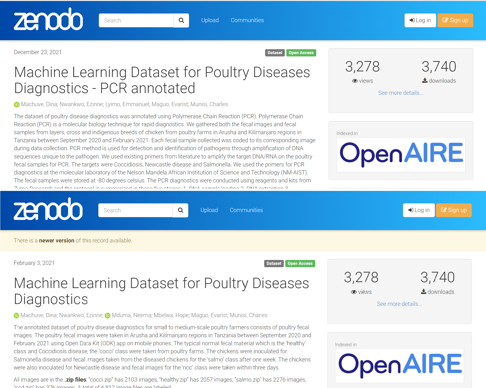
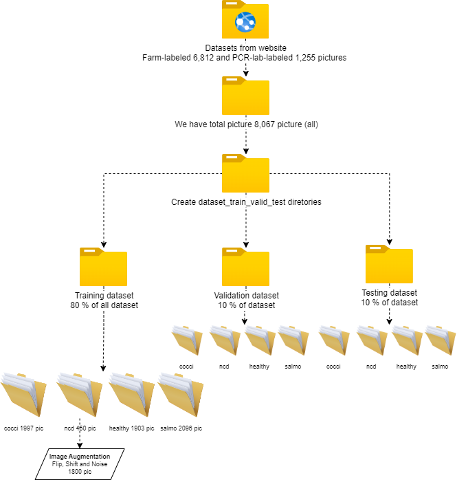

# Diagnostics Fecal Chicken App By Deep Learning
_“Prevention Is Better Than Cure”_ 
– The Dutch philosopher Desiderius Erasmus. In this project, we aim to develop an application that can help to detect the disease of chickens via chicken fecal by deep learning neural network.

## Contents:
- [Problem Statement](#Problem-Statement)
- [Executive Summary](#Executive-Summary)
- [Conclusions and Recommendations](#Conclusions-and-Recommendations)
- [Further Improvements](#Further-Improvements) 
- [Acknowledgements](#Acknowledgements) 

## Problem Statement 
Lately, one of the major transitions in Thailand is related to the agricultural industry which is due to the higher competition in terms of quality and yield. Therefore, smart farming can be used as an opportunity to improve our farm's quality. The use of technology can help to improve farm productivity and increase efficiency through agricultural research and by adopting advanced technologies, including biotechnology, drones, big data, artificial intelligence, and robotics. With the help of these disruptive technologies, new businesses and business models have emerged to help smallholders, who are the majority of Thai farmers, to reduce costs and produce more crops, benefiting the whole economy.[Source](https://www.boi.go.th/upload/content/TIR7_Aw_Smart%20farming_5e5dc88fa8284.pdf) 

Moreover, it is corresponding to the increasing trend of Thailand's chicken meat production which is expected to grow upto 3% in 2023. In addition, after the pandemic, Thailand's chicken market is recovering due to the impact of the supply chain.[Source](https://apps.fas.usda.gov/newgainapi/api/Report/DownloadReportByFileName?fileName=Poultry%20and%20Products%20Annual_Bangkok_Thailand_09-01-2020) The common poultry diseases that affect all farming systems such as Salmonella, Newcastle, and Coccidiosis that effectc of such widespread poultry disease include high mortality rates and failure to compete on the export and consumption market with other high producing countries. These challenges are usually found in small to medium scale farms which managed by young people as they don't have much knowledge on how to cope with those situations, especially when the disease get spreaded. Therefore, an early detection is a very important method to control the spread of the diseases.[Source](https://www.frontiersin.org/articles/10.3389/frai.2022.733345/full)

This project focused on **developing the streamlit application which helps to classify the diseases of a chicken via an image of a chicken's fecal using through the deep learning neural network.**

## Executive Summary
We get the datasets from the [Machine Learning Dataset 1](https://zenodo.org/record/5801834#.Y3MAC3ZBy8U)  [Machine Learning Dataset 2](https://zenodo.org/record/4628934#.Y3MA6HZBy8U). This is a series of information about poultry disease diagnostics was annotated using Polymerase Chain Reaction (PCR) and the farm-labeled fecal image.The poultry fecal images were taken in Arusha and Kilimanjaro regions in Tanzania between September 2020 and February 2021.

It is necessary to divide the data into the respective directories in order to support images for Artificial Neural Network learning using Keras and Tensorflow tools:
**Train subdirectory** is data to use for neural network learning to find optimal weight and make architecture, **Validation subdirectory** is data to make sure the neural network model is not overfitting with training datasets and **Testing subdirectory** is data to make final capability with our model. Due to ncd class in the train subdirectory finding an imbalance problem between another group, we decide to use image aumentation to increase image in this class such as flip, shiftandrotate, and add noise and contrast. Finally we prepare data suitable for training deep learning model using by TensorFlow and Keras.

We use the CNN model as the baseline score of our project and apply the transfer learning and fine-tuning model to improve the preforemane image classification problem. So we select VGG16 and MobileNetV2 model because all both is easy to us in Tensorflow api and high accuracy for this problem 

## Conclusions and Recommendations
The table show performance of all model after training 25 epoch using GPU 1050 and used GPU GTX NVIDIA 1050   
Parameters | CNN_Baseline  | VGG16_Transfer_Learning  |  VGG16_Fine_Tuning | MobileNetV2_Transfer_Learning | MobileNetV2_Fine_Tuning 
----- | ----- | ----- | ----- | ----- | ----- |
Loss function training | 0.14 | 0.50 | 0.03 | 0.06 | 0.02 |
Loss function validation | 0.45 | 0.54 | 0.44 | 0.32 | 1.08 |
Accuracy score training  | 0.95 | 0.82 | 0.99 | 0.98 | 0.99 |
Accuracy score validation  | 0.88 | 0.80 | 0.93 | 0.90 | 0.92 |
F1 score average  | 0.86 | 0.74 | 0.92 | 0.88 | 0.92 |
Size model(MB)  | 24.11 | 56.23 | 110.26 | 9.13 | 23.46 |
Number parameters   | 2,102,564 | 14,716,740 | 14,716,740 | 2,263,108 | 2,263,108 |
Input image size  | (128,128,3) | (224,224,3) | (224,224,3) | (128,128,3) | (128,128,3) |

The performances of all models were practicable and the accuracy score (>80%) in the validation dataset. We can beat the baseline score of CNN model with VGG16 fine tuning, MobileNetV2 transfer learning and MobileNetV2 fine tuning.

The selected model **MobileNetV2 Transfer Learning** was the smallest size with the high accuracy score at 0.90. Moreover, the size of the image input could be smaller when compared to VGG 16 models with low parameter levels. Even if the MobileNetV2 Transfer Learning is lower performance than MobileNetV2_Fine_Tuning but in part of size model which is smallest that good for upload on cloud and github. In addition, the F1 score was equal to 0.84 which can exhibit high performance. 
Last, we tested the performance of the model on the testing dataset was the accuracy score 0.93 and the F1 score was equal to 0.90.

The developed the [streamlit application](https://scenttz-scenttz-capstone-project-diagnostics-fecal-c-app-67tcm7.streamlit.app/) can be used whether on mobile or website using deep learning neural networks. It could predict the image of chicken fecal in Thailand or even in foreign countries. Convolutional layers in deep learning neural network has a high efficiency for image classifying which is corresponding to the well-known theory.

## Further Improvements
 - The lack of information about NCD negatively affects the metrics in this class and the model. Thus, information about NCD should be collected in the future for training the model. 
 - In addition, this limitation is also corresponding to the errors that occur when using the image with two or more fecal or contain text on the images. Those complications might cause an error in the image detection of the model. In the future, object detection could be developed for better classification.
 - Moreover, all the image used for training in this model were obtained from poultry. We think it might be more practicable if we could train the model to be used widely for both poultry and broiler. Thus, it is important to collect more imformation about broiler and their fecals.
 
## Acknowledgements
 - [Machine Learning Dataset for Poultry Diseases Diagnostics - PCR annotated](https://doi.org/10.5281/zenodo.5801834)
 - [Machine Learning Dataset for Poultry Diseases Diagnostics](https://doi.org/10.5281/zenodo.4628934)
 - [Fast and Flexible Image Augmentations](
https://www.mdpi.com/2078-2489/11/2/125)
 - [TensorFlow API](https://lengyi.medium.com/tensorflow-api-custom-object-detection-2-5cdabf8f5e35)
 - [Transfer Learning Image Classification](https://theaisummer.com/cnn-architectures/)
 - [Analysis of deep neural networks](https://culurciello.medium.com/analysis-of-deep-neural-networks-dcf398e71aae)
 - [Deploy your deep learning-based image classification model with Streamlit](https://analyticsindiamag.com/deploy-your-deep-learning-based-image-classification-model-with-streamlit/)
